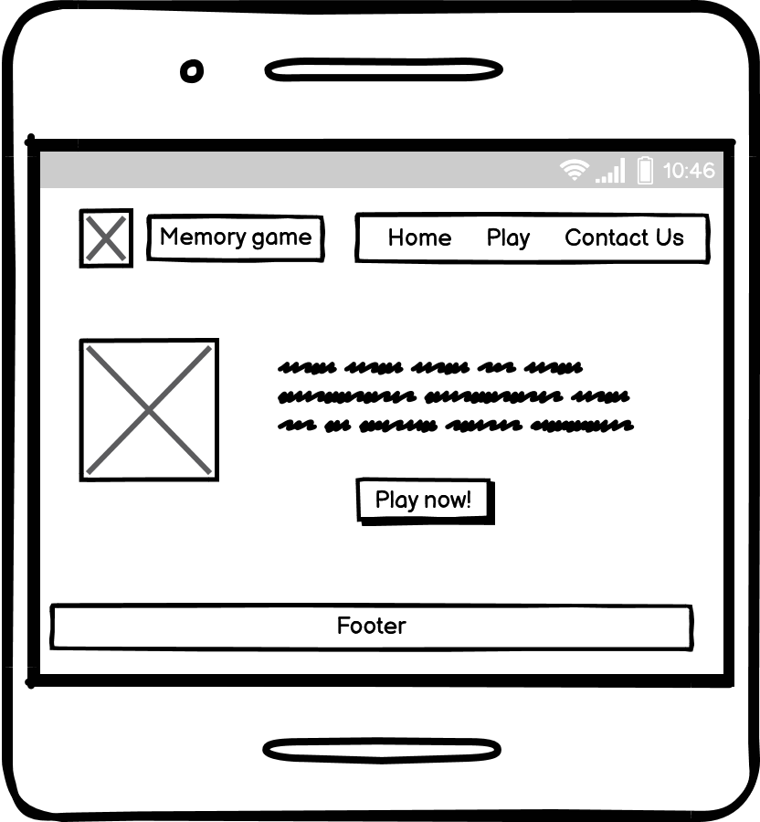
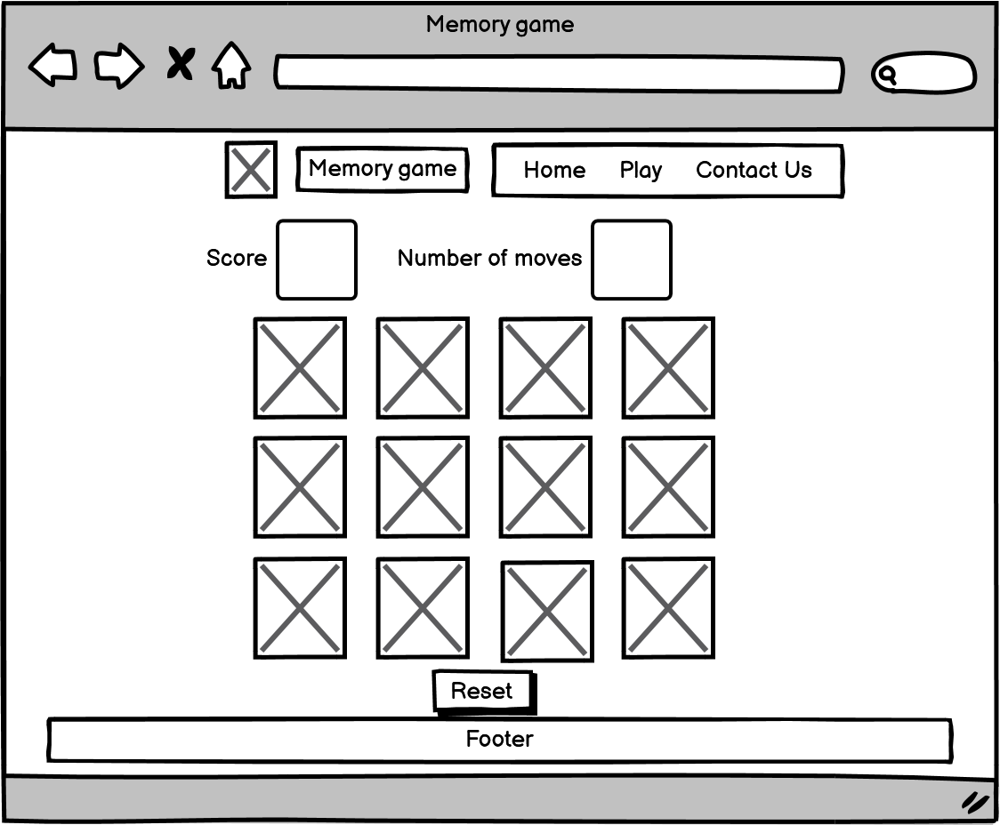
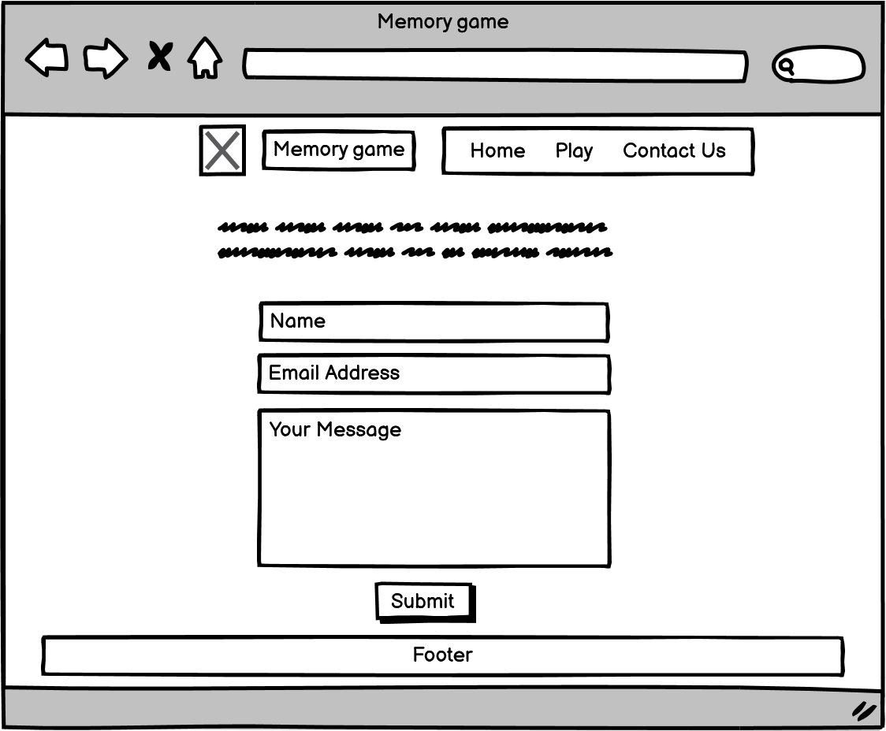
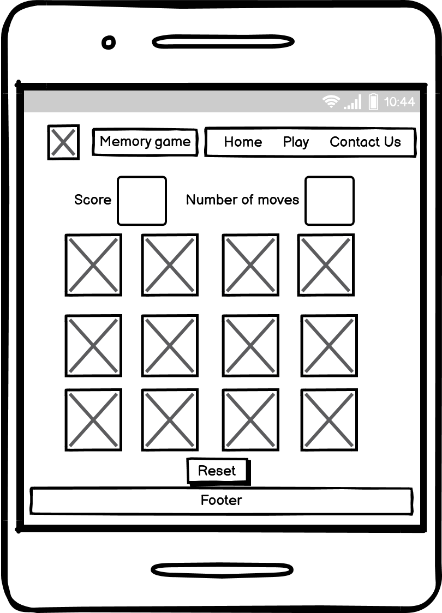
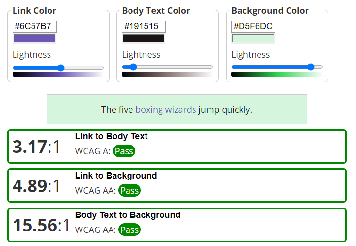

# Freaky Memory

## Interactive Frontend Development Milestone Project
// Insert responsive design 

Freaky Memory is an online card memory game. The site is targeted at users that enjoy logic and brain power games, with a fun theme of aliens and monsters.

# Table of Contents
1. [UX](https://github.com/Michelle3334/freaky_memory#ux)
    * [Website owner goals](https://github.com/Michelle3334/freaky_memory#website-owner-business-goals)
    * [User stories](https://github.com/Michelle3334/freaky_memory#user-stories)
    * [Structure](https://github.com/Michelle3334/freaky_memory#structure-of-the-website)
    * [Wireframes](https://github.com/Michelle3334/freaky_memory#wireframes)
    * [Surface](https://github.com/Michelle3334/freaky_memory#surface)
2. [Features](https://github.com/Michelle3334/freaky_memory#features)
3. [Technologies Used](https://github.com/Michelle3334/freaky_memory#technologies-used)
4. [Testing](https://github.com/Michelle3334/freaky_memory#testing)
    * [Functionality testing](https://github.com/Michelle3334/freaky_memory#functionality-testing)
    * [Code Validation](https://github.com/Michelle3334/freaky_memory#code-validation)
    * [Compatibility testing](https://github.com/Michelle3334/freaky_memory#compatibility-testing)
    * [Performance testing](https://github.com/Michelle3334/freaky_memory#performance-testing)
    * [User stories testing](https://github.com/Michelle3334/freaky_memory#user-stories-testing)
    * [Known bugs](https://github.com/Michelle3334/freaky_memory#known-bugs)
5. [Deployment](https://github.com/Michelle3334/freaky_memory#deployment)
6. [Credits](https://github.com/Michelle3334/freaky_memory#credits)
7. [Acknowledgments](https://github.com/Michelle3334/freaky_memory#acknowledgements)

# UX
## Website owner business goals
* I want my visitors to be able to navigate my website intuitively and easily.
* I would like the game to be fun and enthralling for visitors.
* I would like to build and maintain relationships with potential and current visitors.

## User Stories
### New user goals:
* As a first time user, I want to challenge my memory abilities.
* As a first time user, I want to navigate the website easily.
* As a first time user, I want clear instructions on how to play the game.
* As a first time user, I want to be able to play the game from all device types.
### Returning user goals:
* As a returning user, I would like to provide comments or feedback.
* As a returning user, I want to be able to access the social media links.

## Structure of the website
The website is designed to be user-friendy on all device sizes. Links have hover effects to provide interaction with the users.

[Back to Table of Contents](https://github.com/Michelle3334/freaky_memory#table-of-contents)

## Wireframes
I used Balsamiq to create the wireframes.
* Home page 

* Play game 

* Contact Us 

* Home page mobile view 

* Play game mobile view 

[Back to Table of Contents](https://github.com/Michelle3334/freaky_memory#table-of-contents)

## Surface
### Colors
The main colors used in this project:
* Background color: Granny apple #C3F8CE
* Font color: Seal brown #191515
* Link & hover color: Blue Marguerite #6C57B7
    * Initially I was going to use Bilboa green #317213 for the link and hover text, but during initial development I realised the color contrast was not great enough.

### Fonts
For the main heading element I used Limelight and for all other text I used Josephin Sans. 
Sans-Serif is used as a backup font.
### Images
Images were sourced from pixabay.com. These are credited in credits section.

[Back to Table of Contents](https://github.com/Michelle3334/freaky_memory#table-of-contents)

# Features
## Existing Features
### Navigation Bar
   * Featured on all three pages is a fully responsive navigation bar that has links to the Home Page, Play game and Contact us pages.
   * It is identical on each page and allows the user to move from each page without using the 'back' button on the browser.
     

### Instruction section
   * This section has a fun image and clear instructions on how to play the game. There is also a "play now!" button underneath the instructions.
    

### Play game
   * This is where the main activity will take place on the website.
   * The score and and number of moves updates whilst the user is playing.
   * There is a reset button underneath the game which allows the user to reset the game at any time during play.
       

### Footer
   * The footer section contains links to various social media sites.
   * The links open in a new tab so the user does not have to navigate back to Freaky memory.
    

### Contact Us
   * This page invites the user to submit comments or suggestions to help improve the website.
    

## Features left to implement
* I would like to include various levels of difficulty.

[Back to Table of Contents](https://github.com/Michelle3334/freaky_memory#table-of-contents)

# Technologies Used:
### Programming Languages:
* CSS, HTML and Javascript.
### Git
* Git was used for version control by utilizing the Gitpod terminal to commit to Git and Push to GitHub.
### Github
* GitHub is used to store the projects code after being pushed from Git.
### Google Fonts
* Google Fonts was used to import fonts.
### Font Awesome
* Font Awesome was used on the Home page to add icons for design and UX purposes.
### Balsamiq
* Balsamiq was used to create the wireframes during the design process.

[Back to Table of Contents](https://github.com/Michelle3334/freaky_memory#table-of-contents)

# Testing
## Functionality Testing
* I used Google Chrome developer tools throughout the development process for testing and solving problems with style issues.
* All links were tested multiple times during the development process to ensure that all pages were linked correctly.
* Family members were asked to view the site and point out any bugs.

## Code Validation
* The W3C Markup Validator and W3C CSS Validator Services were used to validate every page of the project to ensure there were no syntax errors in the project.
Javascript validator???

    * Screenshot of css validation 

    * Screenshots of html validation
        * Index.html 
        * Play.html 
        * ContactUs.html 
    
    * Screenshot of javascript validation

[Back to Table of Contents](https://github.com/Michelle3334/freaky_memory#table-of-contents)

## Compatibility Testing
* The website was tested on Google Chrome.
* The website was viewed on a variety of device sizes such as Desktop, Samsung S10 and Samsung tablet, I used the responsive function when inspecting the pages to view various sizes. 

## Performance testing
I ran the Lighthouse tool to check performance of the website. 
Screenshots of the final test are presented below:
* Desktop

* Mobile

[Back to Table of Contents](https://github.com/Michelle3334/freaky_memory#table-of-contents)

## User Stories testing
### As a new user:
* As a first time user, I want to challenge my memory abilities.
    * Everytime the game is reset the cards are in different places making each game different.
* As first time user, I want to navigate the website easily.
    * The navigation bar allows the user to intuitively and easily move between the various pages.
* As a first time user, I want clear instructions on how to play the game. 
    * The home page provides clear instructions.
* As a first time user, I want to be able to play the game on all device types.
    * The site has been developed to be easily accessible on all device types.
### As a returning user:
* As a returning user, I would like to provide comments or feedback.
    * Users can find a contact form on the About us page.
* As a returning user, I want to be able to access the social media links.
    * Users can access social media using the links in the footer of each page.
### As a website owner:
* I want my visitors to be able to navigate my website intuitively and easily.
    * Each site has a navigation bar located at the top of the page.
* I would like the game to be fun and enthralling for visitors.
    * The cards are fun and interesting pictures. Everytime the game is reset the cards are in different places making each game different.
* I would like to build and maintain relationship with potential and current visitors.
    * Users can provide feedback via the contact us form, as well as get in touch via the social media links located in the footer of each page.

## Known Bugs
* 

[Back to Table of Contents](https://github.com/Michelle3334/freaky_memory#table-of-contents)

# Deployment
The project was deployed to GitHub Pages using the following steps, I used Gitpod as a development environment where I commited all changes to git version control system. I used the push command in Gitpod to save changes into GitHub:

1. Log in to GitHub and locate the GitHub Repository.
2. At the top of the Repository, click on the "Settings" Button on the menu.
3. Scroll down the Settings page until you locate the "Pages" Section.
4. Under "Source", click the dropdown called "None" and select "Master Branch" and click on save.
5. The page will automatically refresh.
6. The now published site link shows at the top of the page.

The live link can be found here: ##

To run locally:

1. Log in to GitHub and click on repository to download.
2. Select Code and click Download the ZIP file.
3. After download you can extract the file and use it in your local environment.
4. Alternatively you can Clone or Fork this repository into your github account.

[Back to Table of Contents](https://github.com/Michelle3334/freaky_memory#table-of-contents)

# Credits
## Code
* 

## Content
* The colour contrast for the background, text and links were checked using https://webaim.org/resources/linkcon. 
* Content for the fun facts was obtained from https://www.classicgamesandpuzzles.com/Memory.html. 

## Media
* All images were obtained from pixabay.com.

## Acknowledgements
* My mentor for advice and feedback.
* My family for their endless support and feedback.

[Back to Table of Contents](https://github.com/Michelle3334/freaky_memory#table-of-contents)